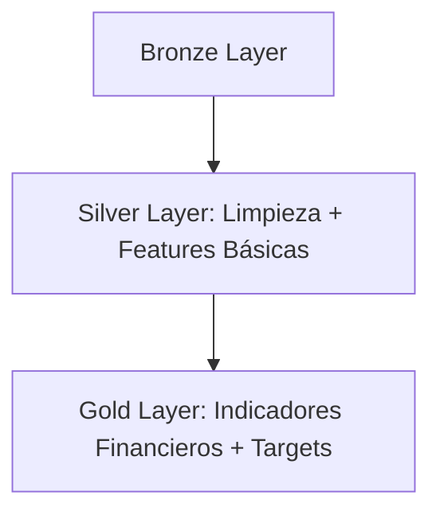
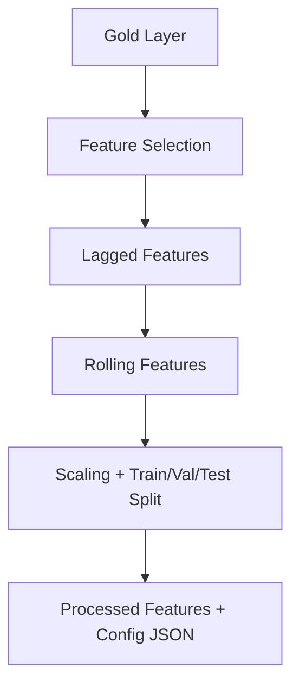
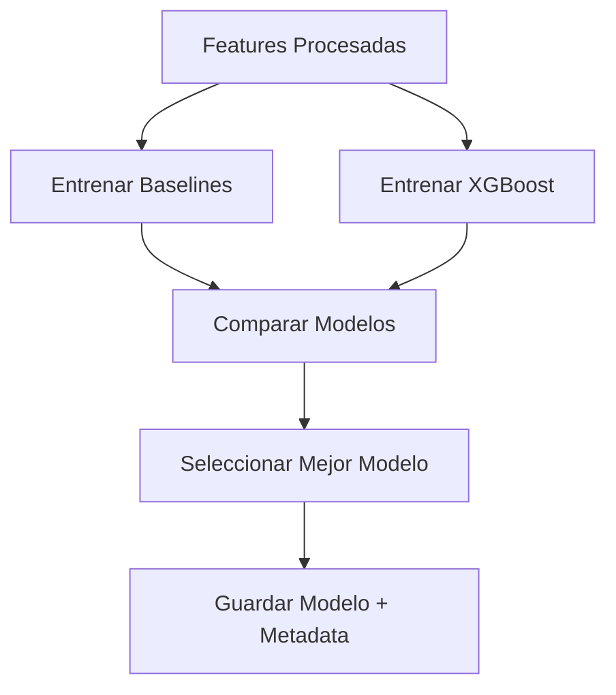
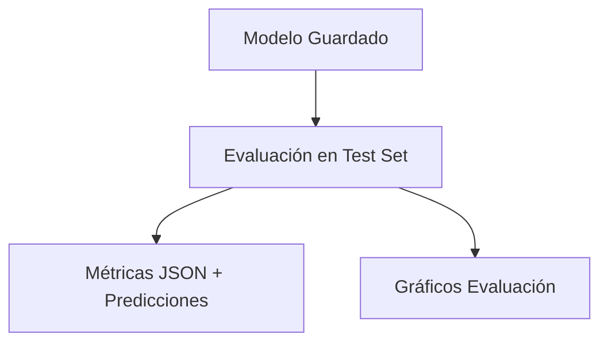
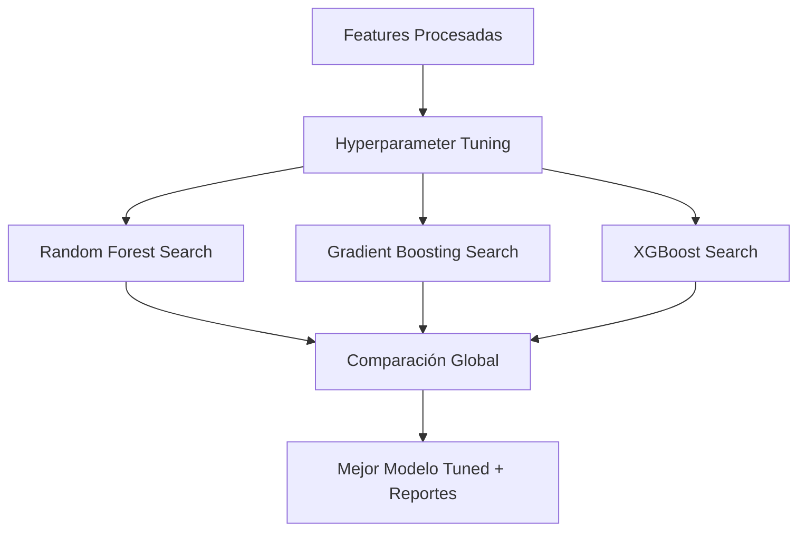

# 🪙 Bitcoin Forecasting Pipeline with MLflow

Este proyecto implementa un pipeline completo de **Data Engineering + Machine Learning** para el pronóstico del precio de Bitcoin.  
Incluye procesos de **ETL**, **feature engineering**, **entrenamiento**, **predicción**, **evaluación**, **hyperparameter tuning** y **MLflow tracking**.  

---

## 📂 Estructura del Proyecto

```
src/
├── data_engineering/
│   ├── extraction.py
│   ├── silver_transformer.py
│   └── gold_transformer.py
├── feature_engineering/
│   └── feature_pipeline.py
├── ml/
│   ├── train.py
│   ├── predict.py
│   ├── evaluate.py
│   ├── hyperparameter_tuning.py
│   └── utils/mlflow_config.py
data/
├── bronze/
├── silver/
├── gold/
└── gold_ml/
models/
reports/
└── figures/
README.md
```

---

## ⚙️ Instalación

```bash
git clone https://github.com/usuario/bitcoin-ml-pipeline.git
cd bitcoin-ml-pipeline
python -m venv venv
source venv/bin/activate  # Linux/Mac
venv\Scripts\activate     # Windows
pip install -r requirements.txt
```

---

## 🔄 Data Engineering

### 1️⃣ `extraction.py`
**Descripción:** Obtiene datos OHLCV de Bitcoin y los guarda en la capa Bronze.  

**Puntos Claves:**
- Conexión con API de datos de mercado (ej. Binance/AlphaVantage).  
- Extracción de **open, high, low, close, volume**.  
- Guardado en formato Parquet en `data/bronze/bitcoin_ohlcv.parquet`.  
- Logging detallado para trazabilidad.  

---

### 2️⃣ `silver_transformer.py`
**Descripción:** Limpieza y preprocesamiento de datos para la capa Silver.  

**Puntos Claves:**
- Conversión de tipos y estandarización de columnas.  
- Manejo de **valores faltantes**.  
- Validación de consistencia de OHLC (open ≤ high, etc.).  
- Creación de features básicas: `daily_return`, `price_range`, `avg_price`, variables temporales.  
- Output: `data/silver/bitcoin_ohlcv_clean.parquet`.  

---

### 3️⃣ `gold_transformer.py`
**Descripción:** Genera la capa Gold con indicadores financieros avanzados y variables target.  

**Puntos Claves:**
- **Indicadores técnicos**: SMA, EMA, RSI, MACD, ATR, volatilidad, ROC.  
- **Indicadores de volumen**: OBV, ratios volumen/moving average.  
- Creación de **targets**:
  - `target_close` (regresión)  
  - `target_return` (regresión)  
  - `target_direction` (clasificación binaria)  
- Manejo de missing values con `ffill` y drop.  
- Output: `data/gold/bitcoin_ml_features.parquet`.  



---

## 🛠️ Feature Engineering

### `feature_pipeline.py`
**Descripción:** Pipeline de preparación de features para ML.  

**Puntos Claves:**
- Selección de features prioritarias (`close`, `volume`, `rsi`, etc.).  
- Creación de **lagged features** (lags 1-5).  
- Rolling statistics (mean, std, volumen rolling).  
- **Split temporal Train/Val/Test** (80/10/10).  
- Escalado con **RobustScaler** y guardado de scaler.  
- Análisis de correlación con **clustermap** (`reports/figures/feature_correlation.png`).  
- Output: `data/gold_ml/btc_processed_features.parquet`.  



---

## 📊 Model Training

### `mlflow_config.py`
**Descripción:** Configuración centralizada de MLflow.  

**Puntos Claves:**
- Tracking URI: `sqlite:///mlflow.db`.  
- Permite registrar experimentos reproducibles.  

---

### `train.py`
**Descripción:** Entrenamiento de modelos baseline y XGBoost.  

**Puntos Claves:**
- Baselines: `LinearRegression`, `RandomForest`, `GradientBoosting`.  
- Modelo avanzado: `XGBoost`.  
- Selección del mejor modelo por **MAE**.  
- Registro de métricas y parámetros en **MLflow**.  
- Guardado de:
  - `models/bitcoin_forecast_model.joblib`  
  - `models/model_metadata.json`  



---

## 🔮 Predicción

### `predict.py`
**Descripción:** Genera predicciones en producción con el mejor modelo entrenado.  

**Puntos Claves:**
- Carga modelo + metadata.  
- Obtiene última fila de features procesadas (`X_latest`).  
- Predicción diaria (`y_pred`).  
- Guarda resultados en:
  - `data/gold_ml/btc_predictions.parquet`  
- Logging en MLflow para trazabilidad.  

---

## 📈 Evaluación

### `evaluate.py`
**Descripción:** Evalúa el modelo final en el test set.  

**Puntos Claves:**
- Métricas: MAE, RMSE, R².  
- Guardado en:
  - `models/evaluation_results.json`  
  - `data/gold_ml/btc_eval_predictions.parquet`  
- Gráficos en `reports/figures/`:
  - `pred_vs_real.png`  
  - `scatter_real_vs_pred.png`  
  - `residuals_distribution.png`  



---

## ⚡ Hyperparameter Tuning

### `hyperparameter_tuning.py`
**Descripción:** Optimización de hiperparámetros con RandomizedSearchCV.  

**Puntos Claves:**
- Modelos soportados: Random Forest, Gradient Boosting, XGBoost.  
- Métrica de selección: **MAE**.  
- Registro de resultados en MLflow.  
- Outputs:
  - `models/tuning_results.json`  
  - `models/best_tuned_model.joblib`  
  - `models/tuning_metadata.json`  
  - `reports/figures/tuning_results.png`  



---

## 📊 MLflow Tracking

```bash
mlflow ui --backend-store-uri sqlite:///mlflow.db
```

Abrir en [http://localhost:5000](http://localhost:5000) para explorar experimentos.  

---

## ✅ Ejecución Paso a Paso

```bash
# 1. Extracción
python src/data_engineering/extraction.py

# 2. Transformación Silver
python src/data_engineering/silver_transformer.py

# 3. Transformación Gold
python src/data_engineering/gold_transformer.py

# 4. Feature Engineering
python src/feature_engineering/feature_pipeline.py

# 5. Entrenamiento
python src/ml/train.py

# 6. Predicción
python src/ml/predict.py

# 7. Evaluación
python src/ml/evaluate.py

# 8. Hyperparameter Tuning
python src/ml/hyperparameter_tuning.py
```

---

## 📌 Conclusión

Este pipeline implementa un flujo **end-to-end reproducible** que cubre:
- Preparación de datos financieros.  
- Feature engineering avanzado.  
- Entrenamiento y evaluación de modelos.  
- Optimización de hiperparámetros.  
- Gestión de experimentos con MLflow.  
